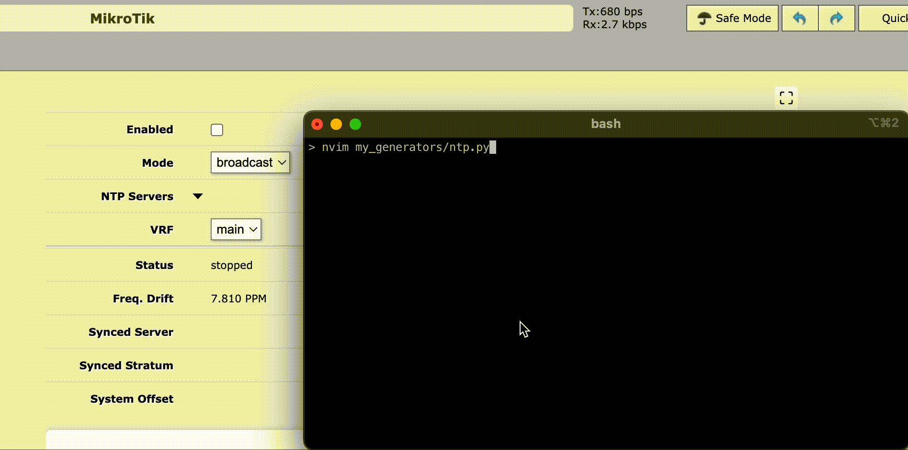

Annet - configuration generation and deploying utility for network equipment
================================================================================

Annet is a configuration generator that can translate differences between old and new
configurations into sequnce of commands. This feature is vital for CLI-based devices,
such as Huawei, Cisco IOS, Cisco NX-OS, Juniper. Devices configured via separate config
files, Linux, FreeBSD and Cumulus are also supported.

It works this way. Annet **gen**\ erates configuration for a device by running Python code,
which usually goes to the Network Source of Truth, like NetBox. Annet then gets the **diff**\ erence
by getting the configuration from the device and comparing it. Finally, Annet translates the difference
into a sequence of commands, called a **patch**. After **deploy**\ ing these commands, the diff will be empty.

``annet`` has a number of modes (subcommands):

* ``annet gen`` - generates the entire config for the specified devices or specified parts of it
* ``annet diff`` - first does gen and then builds diff with current config version
* ``annet patch`` - first does diff and then generates a list of commands to apply diff on the device
* ``annet deploy`` - first does patch and then deploys it to the device.

Usage help can be obtained by calling ``annet -h`` or for a specific command, such as ``annet gen -h``.

.. toctree::
   :hidden:
   :caption: Basic usage:

   usage/install.rst
   usage/cli.rst
   usage/config.rst
   usage/gen.rst

.. toctree::
   :hidden:
   :caption: Extending:

   usage/adapters.rst
   mesh/index.rst
   rpl/index.rst

.. toctree::
   :hidden:
   :caption: Contrib:

   contrib/lab.rst

.. toctree::
    :hidden:
    :caption: Project Links

    GitHub <https://github.com/annetutil/annet>
    PyPI <https://pypi.org/project/annet>
